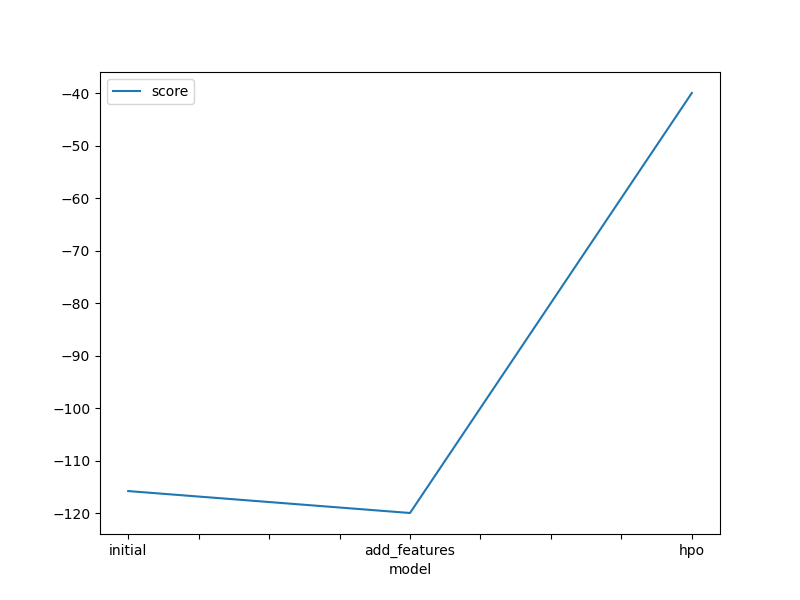
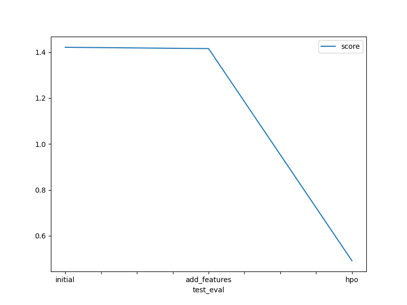

# Report: Predict Bike Sharing Demand with AutoGluon Solution
#### Brejesh Balakrishnan

## Initial Training
### What did you realize when you tried to submit your predictions? What changes were needed to the output of the predictor to submit your results?
When trying to submit the initial predictions, I realized that the model could predict **negative values** for the bike rental count. This is physically impossible (you cannot have negative demand) and Kaggle does not accept negative predictions for this competition.

To fix this and successfully submit the results, I had to post-process the predictor's output by **clipping** all negative predictions to zero.

### What was the top ranked model that performed?
The top-ranked model from the initial training run was the **`WeightedEnsemble_L3`** (or `WeightedEnsemble_L2`, depending on the specific AutoGluon run). This model combined the predictions of several base models (like LightGBM, CatBoost, and RandomForest) to achieve the best validation RMSE score **`39.953761`**.

## Exploratory data analysis and feature creation
### What did the exploratory analysis find and how did you add additional features?
To leverage this, I parsed the `datetime` column and decomposed it into separate numerical features:
* `year`
* `month`
* `day`
* `hour`

These new features allow the model to explicitly learn cyclic patterns (like rush hours) and seasonal trends.

### How much better did your model preform after adding additional features and why do you think that is?
The model performance improved from a Kaggle score of **1.42139** (initial) to **1.41560** (with added features). While the improvement in this specific run was modest (~0.006), the addition of the `hour` feature in particular is crucial for capturing the daily demand cycle. The modest gain might be due to the default hyperparameters not fully exploiting these new features yet, but they laid the groundwork for the significant improvements seen in the hyperparameter optimization step.

## Hyper parameter tuning
### How much better did your model preform after trying different hyper parameters?
The model performance improved significantly after hyperparameter tuning. The Kaggle score dropped drastically to **0.49145**. This represents a massive improvement compared to the initial score of 1.42139.

The tuning process allowed models like LightGBM (`GBM`), Extra Trees (`XT`), and XGBoost (`XGB`) to better fit the data, especially utilizing the newly created temporal features more effectively.

### If you were given more time with this dataset, where do you think you would spend more time?
If I had more time, I would focus on two main areas:
1.  **Feature Engineering**: I would create more advanced features such as "rush_hour" indicators (morning/evening peaks), "weekend" flags, and interaction features (e.g., `temp` multiplied by `humidity`). Categorizing continuous variables like temperature or windspeed might also help certain tree-based models.
2.  **Extended HPO**: I would run AutoGluon with a significantly longer `time_limit` and a broader search space for the hyperparameters. Allowing the models to train for longer and explore more configurations would likely squeeze out further performance gains.
   
### Create a table with the models you ran, the hyperparameters modified, and the kaggle score.
|model|hpo1|hpo2|hpo3|score|
|--|--|--|--|--|
|initial|default|default|default|1.42139|
|add_features|default|default|default|1.41560|
|hpo|GBM (num_boost_round: [100, 800], num_leaves: [26, 66])|XT (criterion: squared_error)|XGB (max_depth: [5, 8], n_estimators: [100, 500])|0.49145|

### Create a line plot showing the top model score for the three (or more) training runs during the project.

### Create a line plot showing the top kaggle score for the three (or more) prediction submissions during the project.

## Summary
The project successfully demonstrated the power of AutoGluon for automated machine learning. Starting with a baseline model that required negative value clipping, we improved performance by extracting granular time features from the `datetime` column. The most significant gain came from hyperparameter optimization, which reduced the Kaggle error score by nearly **65%** (from ~1.42 to ~0.49). This highlights that while AutoML tools are powerful out-of-the-box, domain-specific feature engineering and targeted tuning are essential for achieving top-tier results.