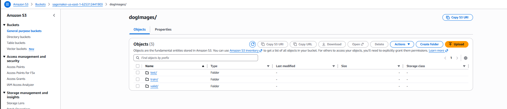
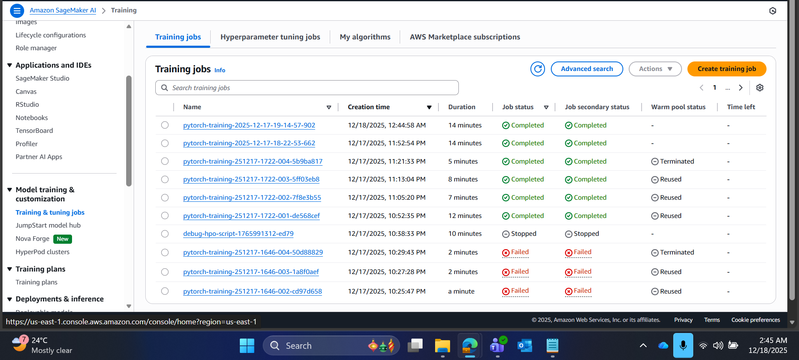
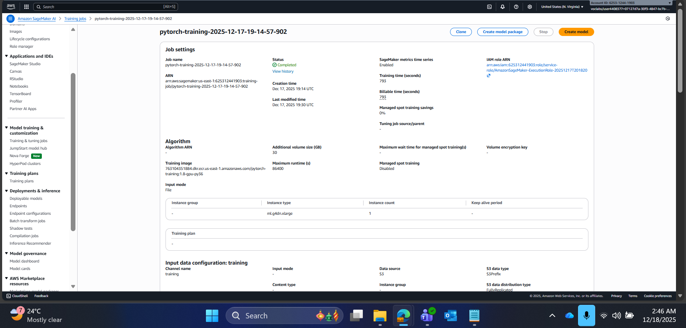
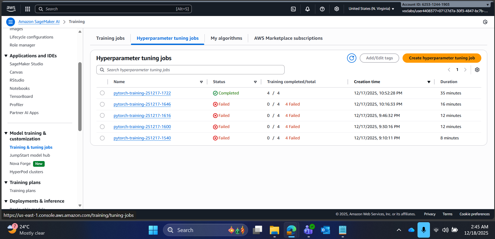
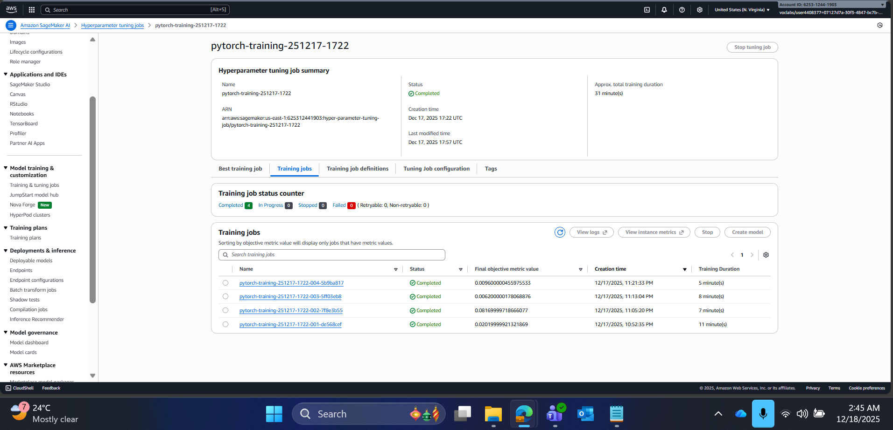
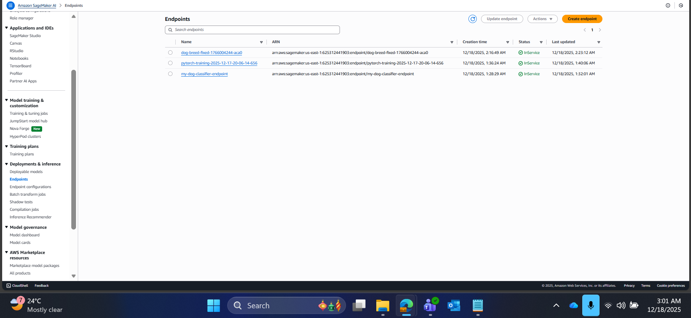
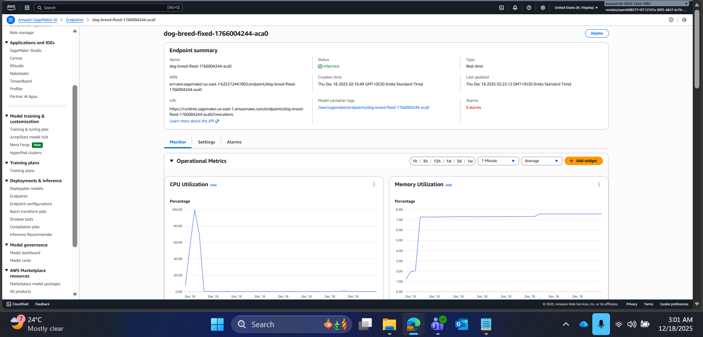

# Image Classification using AWS SageMaker

Use AWS Sagemaker to train a pretrained model that can perform image classification by using the Sagemaker profiling, debugger, hyperparameter tuning and other good ML engineering practices. This project utilizes AWS SageMaker to implement a complete machine learning workflow, including transfer learning with PyTorch, Hyperparameter Tuning (HPO), advanced debugging, profiling, and real-time model deployment for a dog breed classification task.

## Project Set Up and Installation
The project was developed primarily within an **AWS SageMaker Studio Notebook** environment, leveraging the native SageMaker SDK.
**Steps to do the same:**
1. Enter AWS through the gateway in the course and open SageMaker Studio. 
2. Download the starter files.
3. Download/Make the dataset available. 

## Dataset
The provided dataset is the dogbreed classification dataset which can be found in the classroom.

### Access
The dog breed classification dataset was compressed (`dogImages.zip`) and uploaded to an **Amazon S3 bucket** to ensure high-speed access by SageMaker training jobs.


## Hyperparameter Tuning

### What kind of model did you choose for this experiment and why?

I chose a **ResNet50** model, pretrained on the ImageNet dataset, as the base architecture.

* **Rationale:** The dog breed classification dataset contains 133 classes, which is too small to train a model as deep as ResNet50 from scratch. **Transfer learning** is essential here. By leveraging the low-level visual features (edges, textures) already learned by ResNet50, I only needed to fine-tune a new, custom Fully Connected layer (classifier head) to map those features to the 133 dog breed classes. This approach accelerates convergence and significantly improves final accuracy.





### Give an overview of the types of parameters and their ranges used for the hyperparameter search

I used the **HyperparameterTuner** with a **Bayesian search strategy** to efficiently explore the parameter space for two critical hyperparameters, aiming to **minimize the `average test loss`**.

| Parameter Name | Type | Range | Default Value | Notes |
| :--- | :--- | :--- | :--- | :--- |
| **learning\_rate** (`lr`) | Continuous | `0.001` to `0.1` | N/A | Controls step size during gradient descent. |
| **batch\_size** (`batch-size`) | Integer | `32` to `128` | N/A | The number of samples processed per update. |

The best performing job was retrieved to continue training/deployment:
* **Best Hyperparameters:**
    * `learning_rate`: **0.0023832264170425455**
    * `batch_size`: **100**
    * `epochs`: **5**





## Debugging and Profiling

Debugging and profiling were implemented using the **SageMaker Debugger (SMDebug)** by configuring `DebuggerHookConfig` and `ProfilerConfig` on the estimator.

### Debugging (SMDebug)
1.  **Tensor Collection:** I configured SMDebug to automatically capture and save key tensors (`gradients`, `weights`, `biases`, and the `CrossEntropyLoss` output) across the training (`TRAIN`) and evaluation (`EVAL`) modes.
2.  **Built-in Rules:** I attached standard SMDebug rules to automatically monitor for training anomalies:
    * `VanishingGradient`, `Overfit`, and `Overtraining`.
    * `PoorWeightInitialization` (which proved useful in analysis).

### Profiling (SMDebug Profiler)
1.  **Configuration:** The Profiler was enabled to collect system resource utilization data (CPU, GPU, Memory, I/O) at a high frequency (e.g., 500ms).
2.  **Rule-based Analysis:** Profiler rules (e.g., `LowGPUUtilization`, `CPUBottleneck`) were attached to proactively identify and flag performance bottlenecks that could slow down the training process.

### Results
**TODO**: What are the results/insights did you get by profiling/debugging your model?
1.  **Anomalous Behavior Detected (Debugging):**
    * The **`PoorWeightInitialization`** rule returned **"IssuesFound"**. This indicates instability in the initial training steps, likely caused by the random initialization of the new Fully Connected (FC) head, suggesting the initial gradients were too large or too small.
2.  **Performance Insights (Profiling):**
    * The **`LowGPUUtilization`** rule triggered on the **[Number]** instances, indicating that the GPU was sometimes idle, likely waiting for data or due to internal PyTorch overhead. This could suggest a slight bottleneck in the CPU-to-GPU transfer pipeline or using an oversized instance for the current `batch-size`.
    * The **`CPUBottleneck`** rule did **not** trigger, confirming that the data loading and preprocessing pipeline was efficient enough not to starve the GPU of data.

Profiler resutls are included and can be found in [ProfilerReport/profiler-output/](./ProfilerReport/profiler-output/profiler-report.html)

## Model Deployment
**TODO: Give an overview of the deployed model and instructions on how to query the endpoint with a sample input.**

The model was deployed to a real-time HTTPS endpoint using a custom deployment structure to provide a robust API for image classification.

* **Deployment Method:** I used the `sagemaker.pytorch.PyTorchModel` class with a custom `ImgPredictor` class and a dedicated inference script (`deploy_endpoint.py`). This allows for full control over the inference pipeline.
* **Instance Type:** The model was hosted on an `ml.m5.large` instance.
* **Custom Inference Handlers (`deploy_endpoint.py`):**
    * **`input_fn`:** Accepts the raw binary payload (`image/jpeg` ContentType) and converts it into a PIL Image object.
    * **`predict_fn`:** Applies the testing-time image transformations (Resize, CenterCrop, Normalize) and executes the model's forward pass, returning the prediction probabilities as a NumPy array.
    * **`model_fn`:** Loads the final `model.pth` state dictionary, handling device mapping (CPU/GPU) to prevent deployment timeouts.

**Instructions to Query the Endpoint:**

The custom setup allows the endpoint to be queried with raw image bytes, simplifying client-side code:

1.  **Prepare Payload:** Load the image file in binary format.
    ```python
    import os
    import io
    
    test_file_path = "dogImages/test/040.Bulldog/Bulldog_02817.jpg"
    with open(test_file_path , "rb") as f:
        payload = f.read()
    ```
2.  **Invoke Endpoint:** Call the `predictor.predict` method, passing the raw bytes and specifying the content type.
    ```python
    response = predictor.predict(payload, initial_args={"ContentType": "image/jpeg"}) 
    # Response is a NumPy array of probabilities/logits.
    ```
3.  **Process Output:**
    ```python
    predicted_class_index = np.argmax(response, 1)[0]
    # Use the loaded `idx_to_class` dictionary to get the breed name.
    ```






## Standout Suggestions
**TODO (Optional):** This is where you can provide information about any standout suggestions that you have attempted.

Beyond the basic requirements, the following steps were taken or derived from the debugging phase to improve robustness and efficiency:

1.  **Custom Inference Pipeline for Production Input:**
    * Instead of relying on client-side preprocessing and sending NumPy arrays, I implemented a robust custom deployment using `sagemaker.pytorch.PyTorchModel` with a custom **`ImgPredictor`** and a dedicated **`deploy_endpoint.py`** script.
    * This allows the endpoint to directly accept raw image bytes with `Content-Type: image/jpeg`. This **offloads preprocessing logic to the high-performance SageMaker container**, which simplifies client integration and is the recommended approach for image inference services.

2.  **Addressing Training Anomalies with Optimization:**
    * The debugging phase identified the **`PoorWeightInitialization`** rule as triggered, indicating instability in the new custom classifier head.
    * **Suggestion:** To proactively fix this, future iterations would implement **Xavier or He Initialization** for the weights of the new linear layers in `train_model.py`. Additionally, incorporating a **Learning Rate Warmup** scheduler would stabilize the gradients during the initial, critical training steps, preventing erratic loss behavior.

3.  **Cost Optimization and Scaling (Post-Launch):**
    * While testing was performed on a powerful instance (e.g., `ml.m5.large`), a standout suggestion for production is to transition the endpoint to a **cost-optimized instance type** (e.g., `ml.c5.large` or `ml.t2.medium`) if latency requirements are met.
    * Furthermore, I recommend setting up **Amazon CloudWatch Auto Scaling** policies for the endpoint. This allows the endpoint's instance count to dynamically increase during peak hours and decrease during low-traffic periods, ensuring both high availability and cost efficiency.