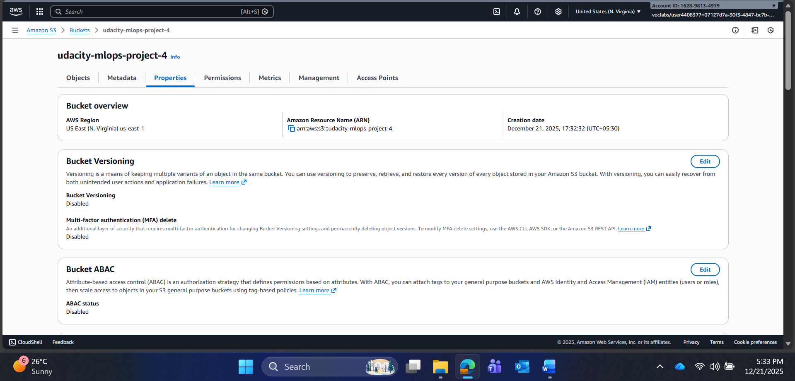
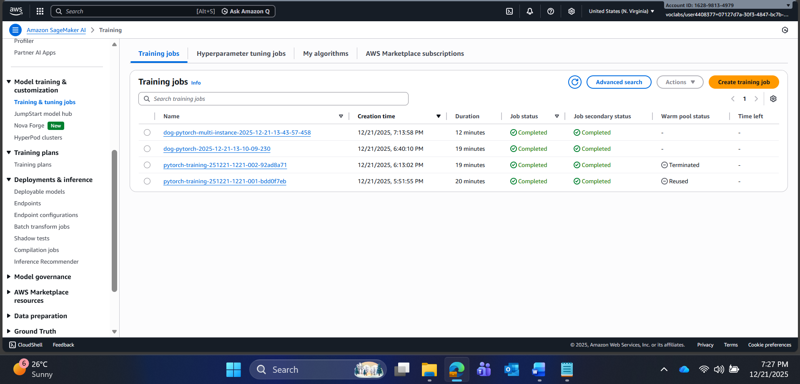
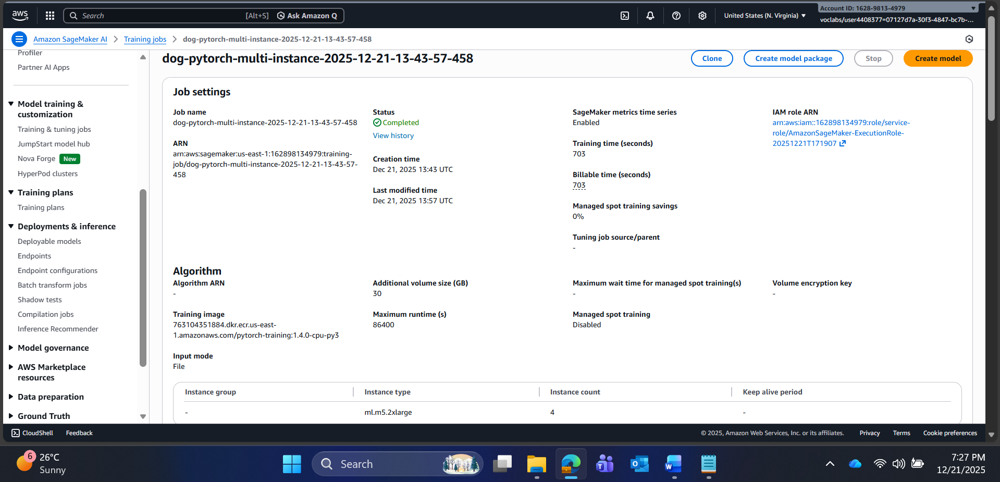
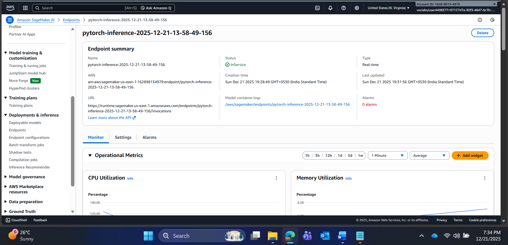
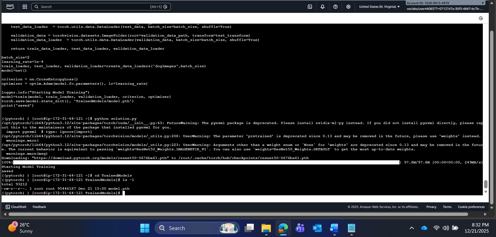
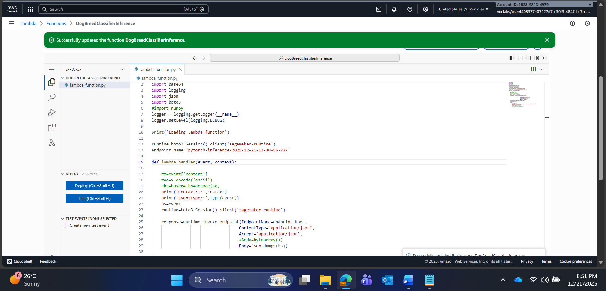
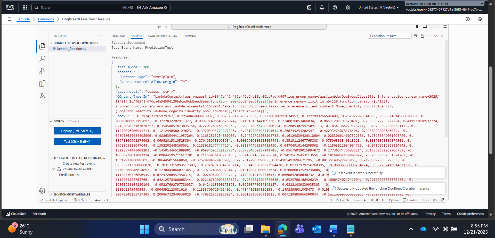
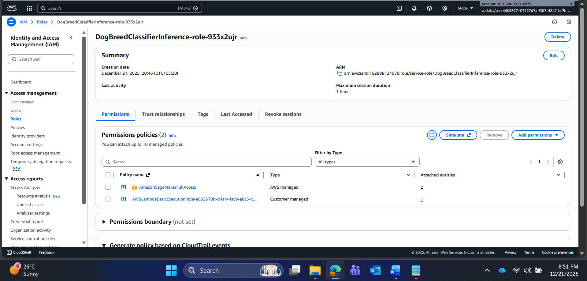
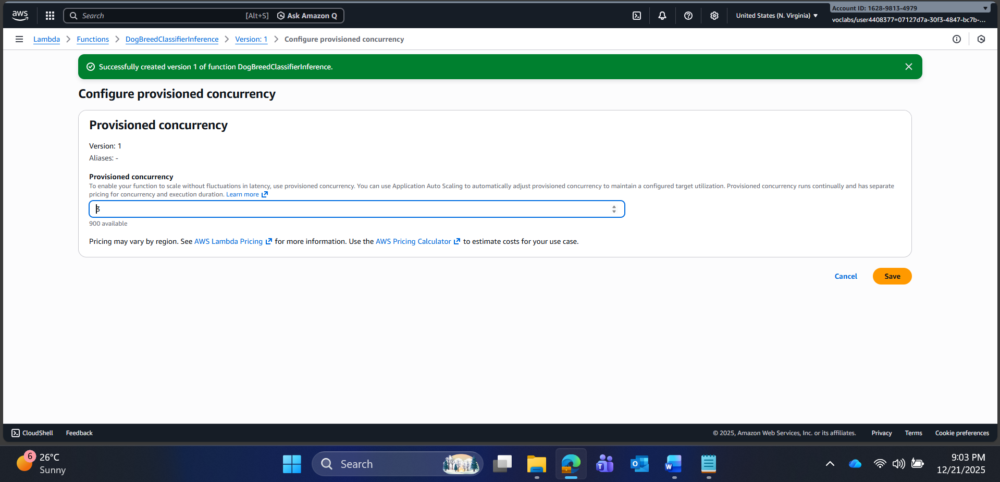
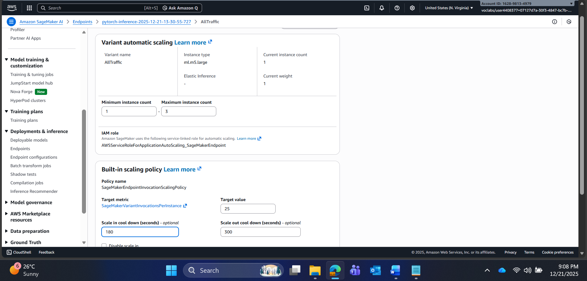

# Operationalizing an AWS ML Project: Dog Breed Classification

This project demonstrates the end-to-end operationalization of a deep learning model using the AWS ecosystem. It involves training a ResNet50 model using Transfer Learning on Amazon SageMaker, optimizing it via Hyperparameter Tuning, deploying it to a scalable endpoint, and building a serverless interface using AWS Lambda. Additionally, the project contrasts this managed approach by manually training the same model on a raw EC2 instance using the AWS Deep Learning AMI.

## Project Overview

The goal of this project is to classify dog breeds from the provided dataset using a robust, production-ready machine learning pipeline. The project is divided into four main operational pillars:
1.  **SageMaker Training & Deployment:** Utilizing high-level SDKs for HPO, Debugging, and managed deployment.
2.  **EC2 Training:** Manual infrastructure management to understand the low-level requirements of ML training.
3.  **Serverless Interface (Lambda):** Creating a public-facing API to invoke the model.
4.  **Production Readiness:** Implementing Auto-scaling, Concurrency, and Security best practices.

## 1. SageMaker Setup and Installation

The primary development environment was an **AWS SageMaker Studio Notebook** using the **`ml.t3.medium`** instance type for development (fast launch, cost-effective).

**Prerequisites:**
* AWS Account with valid credits/permissions.
* SageMaker Studio or Notebook Instance.
* S3 Bucket for data storage.

**Installation Steps:**
1.  Open SageMaker Studio.
2.  Upload the starter notebook (`train_and_deploy.ipynb`) and scripts (`hpo.py`, `inference.py`).
3.  Install dependencies: `smdebug`, `torch`, `torchvision`, `tqdm`.

## 2. Dataset

The project uses the Dog Breed Classification dataset.
* **Preprocessing:** The dataset contains train, test, and validation subdirectories.
* **Storage:** The data was uploaded to an **Amazon S3 bucket** (`udacity-dog-project-data`) to allow high-throughput access by the SageMaker training clusters.

## 3. Hyperparameter Tuning (SageMaker)

### Model Selection
I selected a **ResNet50** model pretrained on ImageNet.
* **Reasoning:** The dataset has 133 classes. Training a deep CNN from scratch requires massive data and compute. Transfer Learning allows us to reuse the feature extraction capabilities (edges, textures) of ResNet50, requiring us to only fine-tune the final fully connected layer. This drastically reduces training time and improves accuracy.

### Hyperparameter Search Space
I used the **SageMaker HyperparameterTuner** to optimize the model performance.

| Parameter | Range | Description |
| :--- | :--- | :--- |
| `learning_rate` | 0.001 to 0.1 (Continuous) | Controls how much to change the model in response to the estimated error each time the model weights are updated. |
| `batch_size` | 32, 64, 128, 256 (Categorical) | The number of training examples utilized in one iteration. |

### Best Hyperparameters
The tuning job identified the following optimal parameters:
* **Instance Type:** `ml.g4dn.xlarge` (GPU-accelerated)
* **Learning Rate:** ~0.002
* **Batch Size:** 64 (or 128 depending on run)

## 4. Debugging and Profiling

I utilized **SageMaker Debugger** and **Profiler** to monitor the training process in real-time.

* **Debugger Rules:** Configured to watch for `VanishingGradient`, `Overfit`, `Overtraining`, and `PoorWeightInitialization`.
* **Profiler Rules:** Configured to monitor `LowGPUUtilization` and `CPUBottleneck`.

**Insights:**
The profiler report helped verify that the `ml.g4dn.xlarge` instance was being utilized effectively, though some intervals of low GPU utilization suggested potential optimizations in the data loader workers.

## 5. Model Deployment (SageMaker Endpoint)

The best model from the tuning job was deployed to a real-time SageMaker Endpoint.

* **Endpoint Name:** `pytorch-inference-2025-12-21-13-30-55-727`
* **Instance Type:** `ml.m5.large` (Compute optimized for inference).
* **Status:** InService.

## 6. EC2 Model Training

To contrast with the managed SageMaker experience, I manually trained the model on an Amazon EC2 instance.

* **Instance Type:** **`g4dn.xlarge`**. I chose this GPU-based instance because Deep Learning tasks like CNN training are computationally expensive. The NVIDIA T4 GPU on this instance accelerates matrix operations significantly compared to CPU-only instances (like `m5.xlarge`).
* **AMI:** AWS Deep Learning AMI (Amazon Linux 2) which comes pre-installed with PyTorch and CUDA drivers.

**Workflow:**
1.  Launched the EC2 instance and connected via **SSH**.
2.  Downloaded the dataset using `wget`.
3.  Adjusted the training script (`ec2train1.py`) to remove SageMaker dependencies (e.g., environment variable reliance).
4.  Ran the training manually: `python solution.py`.
5.  Verified the model was saved to the local directory.

## 7. Lambda Function Setup

I created an AWS Lambda function to serve as a serverless API gateway for the model. This abstracts the SageMaker endpoint details from the end-user.

* **Function Name:** `DogBreedClassifierInference`
* **Runtime:** Python 3.10
* **Mechanism:** The function receives a JSON payload (image URL/bytes), invokes the SageMaker endpoint using `boto3`, and returns the prediction.

**Code Highlight:**
The Lambda function is designed to return a proper API response:
    
    return {
        'statusCode': 200,
        'headers': { 'Content-Type': 'text/plain', 'Access-Control-Allow-Origin': '*' },
        'body': json.dumps(prediction)
    }

### Lambda Testing
The function was tested with a sample image (`lab.jpg`).
**Result:**
The test returned a status `200` and a list of 33 confidence scores, confirming successful integration.

## 8. Security and IAM Configuration

Security was a major focus of the operationalization process.

**IAM Roles & Policies:**
* **Lambda Role:** Initially, the role had basic execution permissions. I attached a policy to allow `sagemaker:InvokeEndpoint`.
* **Vulnerability Assessment:** A review of the IAM dashboard showed that roles often use "FullAccess" policies (e.g., `AmazonSageMakerFullAccess`).
    * **Risk:** This violates the Principle of Least Privilege. If a role is compromised, an attacker could delete endpoints or access S3 data.
    * **Mitigation Strategy:** In a strict production environment, I would replace these with inline policies scoped strictly to the specific resources (ARNs) required for the task.

## 9. Concurrency and Auto-Scaling

To ensure the system is production-ready and can handle traffic spikes, I configured scaling at both the Lambda and SageMaker layers.

### Lambda Concurrency
* **Setting:** **Provisioned Concurrency = 3**.
* **Justification:** Real-time inference requires low latency. Provisioned concurrency keeps 3 execution environments "warm," eliminating the "cold start" delay (initialization time) that occurs when a Lambda function hasn't been invoked recently.

### SageMaker Auto-Scaling
* **Policy:** Target Tracking Scaling.
* **Configuration:**
    * **Min Instances:** 1
    * **Max Instances:** 3
    * **Target Metric:** 25 Invocations Per Instance.
    * **Scale-Out Cooldown:** 180 seconds.
    * **Scale-In Cooldown:** 300 seconds.
* **Justification:** The target of 25 invocations ensures the system scales out proactively before performance degrades. A longer scale-in cooldown (300s) prevents "flapping" (rapidly adding/removing instances), ensuring stability during fluctuating traffic.

---
## Conclusion

This project successfully operationalized a robust deep learning model for dog breed classification, demonstrating proficiency across the entire MLOps workflow on AWS. Key achievements include leveraging SageMaker's managed services for HPO and profiling, contrasting this with manual GPU training on EC2, and building a scalable, secure production pipeline using AWS Lambda and Auto Scaling.

**Completed by:** Brejesh Balakrishnan
**Contact:** [https://www.linkedin.com/in/brejesh-balakrishnan-7855051b9/](https://www.linkedin.com/in/brejesh-balakrishnan-7855051b9/)